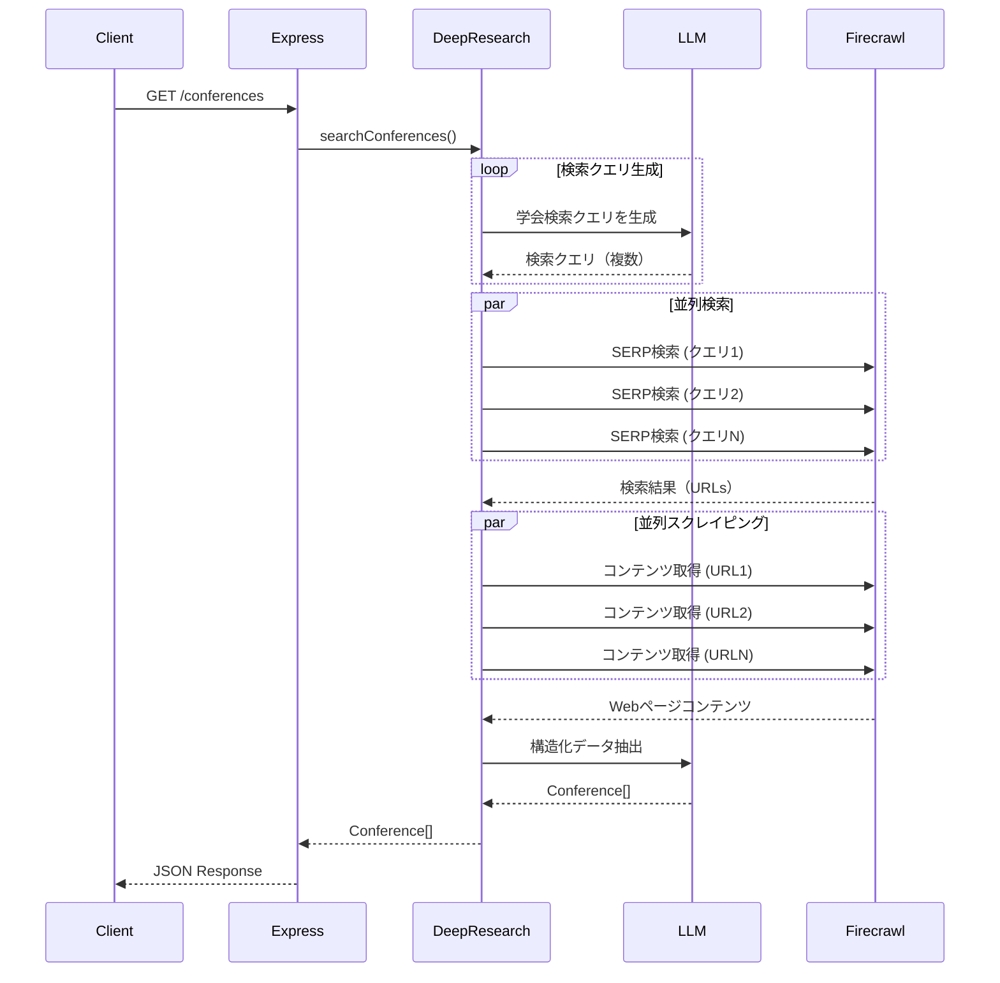

# 技術仕様書 - 学会・カンファレンス検索API

## 技術スタック

### 言語・ランタイム
- **TypeScript** 5.7.3
- **Node.js** 18+ (Dockerでは18-alpine)
- **tsx** 4.19.2（TypeScript実行環境）

### Webフレームワーク
- **Express** 4.18.3
  - RESTful APIサーバーとして使用
  - ミドルウェア: `cors`, `express.json()`

### AI/LLM
- **AI SDK** (@ai-sdk) 4.1.17
  - Vercel AI SDKを使用
  - 構造化出力（Structured Outputs）対応

- **LLMプロバイダー**（優先順位順）:
  1. **カスタムモデル**: `CUSTOM_MODEL`が設定されている場合
  2. **DeepSeek R1** (Fireworks): `FIREWORKS_KEY`が設定されている場合
  3. **OpenAI o3-mini**: デフォルト（`OPENAI_KEY`必須）

### Web検索・スクレイピング
- **Firecrawl** (@mendable/firecrawl-js) 1.16.0
  - SERP（検索エンジン結果ページ）検索
  - Webページのコンテンツ取得・構造化

### データ検証
- **Zod** 3.24.1
  - スキーマ定義とバリデーション
  - レスポンス型の厳密な検証

### その他のライブラリ
- **js-tiktoken** 1.0.17（トークンカウント）
- **p-limit** 6.2.0（並列処理制御）
- **lodash-es** 4.17.21（ユーティリティ）
- **uuid** 9.0.1（ID生成、必要に応じて）

## 環境変数

### 必須
```bash
# Firecrawl API
FIRECRAWL_KEY="your_firecrawl_key"

# LLM (いずれか1つ必須)
OPENAI_KEY="your_openai_key"
# または
FIREWORKS_KEY="your_fireworks_key"
```

### オプション
```bash
# Firecrawl設定
FIRECRAWL_BASE_URL="http://localhost:3002"  # セルフホスト時
FIRECRAWL_CONCURRENCY="2"  # 並列度（デフォルトは環境依存）
CONCURRENCY_LIMIT="5"  # アプリ全体の並列度

# LLM設定
OPENAI_ENDPOINT="https://api.openai.com/v1"  # カスタムエンドポイント
CUSTOM_MODEL="llama3.1"  # カスタムモデル名
CONTEXT_SIZE="128000"  # コンテキストサイズ（デフォルト128k）

# サーバー設定
PORT="3051"  # APIサーバーポート（デフォルト3051）
```

## アーキテクチャ

### ディレクトリ構造
```
src/
├── api.ts                    # Express APIサーバー（改造対象）
├── deep-research.ts          # ディープリサーチコア（改造対象）
├── prompt.ts                 # プロンプト定義（改造対象）
├── feedback.ts               # フィードバック処理（削除予定）
├── run.ts                    # CLIエントリーポイント（不使用）
└── ai/
    ├── providers.ts          # LLMプロバイダー設定
    └── text-splitter.ts      # テキスト分割ユーティリティ
```

### 改造方針

#### 1. APIエンドポイント（src/api.ts）
**既存**:
```typescript
POST /api/research          // 汎用リサーチ
POST /api/generate-report   // レポート生成
```

**新規追加**:
```typescript
GET /conferences            // 学会・カンファレンス検索
```

#### 2. プロンプト改造（src/prompt.ts）
**変更箇所**: `systemPrompt()`関数

**既存の役割**:
- 汎用的なリサーチアシスタント向けの指示

**新しい役割**:
- 日本国内の学会・カンファレンス情報を検索
- 公式サイトからの情報抽出に特化
- 構造化データ（JSON）を返すよう指示

**プロンプト改造イメージ**:
```typescript
export const conferenceSystemPrompt = () => {
  const now = new Date().toISOString();
  return `あなたは日本国内の学会・カンファレンス情報を専門に検索するアシスタントです。
現在時刻: ${now}

以下の指示に従ってください：
- 日本国内の学会・カンファレンス情報のみを検索する
- 公式サイトからの情報のみを使用する（WikiCFPなどのアグリゲーションサイトは除外）
- 以下の情報を構造化して抽出する：
  - 学会名、開催日、締切日、主催者、参加対象、説明文、公式サイトURL
- 情報が不足している場合は空文字または妥当なデフォルト値を使用する
- 日付は ISO 8601 形式（YYYY-MM-DD）で返す`;
};
```

#### 3. ディープリサーチコア（src/deep-research.ts）
**改造内容**:
- 検索クエリ生成を学会検索に特化
- 構造化データ抽出ロジックを追加
- 10件以上の結果を並列で収集

**新規関数（追加予定）**:
```typescript
async function searchConferences(options?: {
  minResults?: number;  // デフォルト10
}): Promise<Conference[]>

interface Conference {
  link: string;
  name: string;
  type: string;
  scope: string;
  deadline: string;
  term: string;
  conference_start_date: string;
  conference_end_date: string;
  icon: string;
  conference_organizer: string;
  institution: string;
  text: string;
  date: string;
  read_status: "";
  labels: [];
  tags: [];
}
```

## データフロー



## パフォーマンス考慮事項

### 並列処理
- **p-limit**を使用した並列度制御
- デフォルト並列度: `CONCURRENCY_LIMIT`環境変数（推奨: 3-5）
- Firecrawl無料版の場合は1に設定推奨

### タイムアウト
- Express全体のタイムアウト: 60秒
- Firecrawl個別リクエストタイムアウト: 30秒
- 再試行ロジック: 失敗時は次の検索結果を試す

### キャッシュ
- 現段階では実装しない（リアルタイム検索優先）
- 将来的にRedisなどで短期キャッシュを検討

## セキュリティ

### CORS設定
- 現在: すべてのオリジンを許可（`cors()`）
- 本番環境では特定のオリジンのみ許可するよう設定

### 入力検証
- Zodスキーマでクエリパラメータを検証
- SQLインジェクション対策（DB導入時）

### レート制限
- 将来的に`express-rate-limit`導入を検討

## デプロイ

### Docker構成
- ベースイメージ: `node:18-alpine`
- ポート: 3051
- ボリュームマウント: `./ -> /app/`（開発時）

### 起動コマンド
```bash
# 開発環境
npm run api

# Docker環境
docker compose up -d
docker compose run --rm deep-research npm run api
```

## テスト方針（将来的に実装）

### 単体テスト
- LLMプロンプトのバリデーション
- データ抽出ロジック
- 日付正規化ロジック

### 統合テスト
- APIエンドポイントのE2Eテスト
- モックFirecrawlレスポンスでのテスト

### テストツール候補
- Jest or Vitest
- Supertest（APIテスト）

## 既存機能との共存

### 残す機能
- 既存の`/api/research`と`/api/generate-report`エンドポイント
- 汎用的なディープリサーチ機能

### 削除する機能
- CLIインタラクティブモード（`src/run.ts`、`src/feedback.ts`）
- Markdown Report生成（学会検索には不要）

## 参考リンク
- [AI SDK Documentation](https://sdk.vercel.ai/docs)
- [Firecrawl API Documentation](https://docs.firecrawl.dev/)
- [Express Documentation](https://expressjs.com/)
